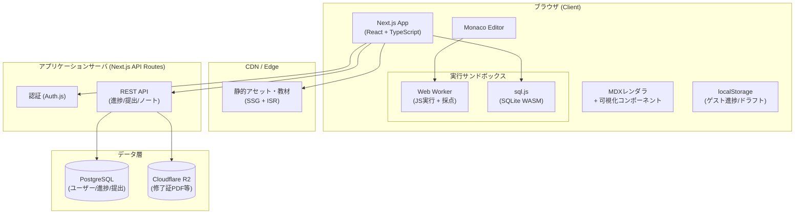
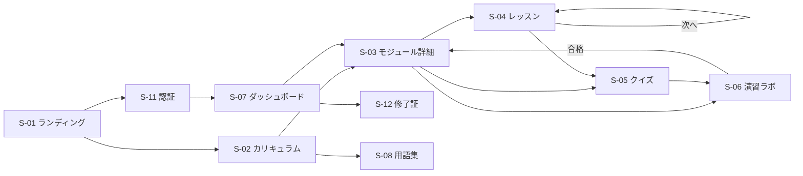
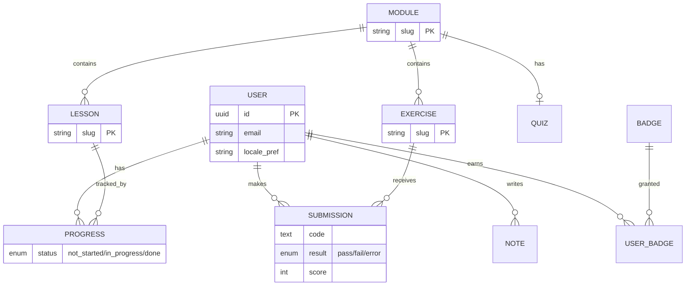

# 基本設計書

## DDIA Learning Lab — 『Designing Data-Intensive Applications』ハンズオン学習プラットフォーム

| 項目             | 内容                                    |
| ---------------- | --------------------------------------- |
| ドキュメント種別 | 基本設計書 (Basic Design Document)      |
| バージョン       | 1.0                                     |
| 作成日           | 2026-07-11                              |
| 対象システム     | DDIA Learning Lab (Webアプリケーション) |
| 関連文書         | 02\_詳細設計書.md                       |

---

## 1. プロジェクト概要

### 1.1 目的

Martin Kleppmann著『Designing Data-Intensive Applications』(以下 DDIA) が扱う分散データシステムの主要概念を、**日本語/英語切り替え可能なオリジナル解説コンテンツ**と**ブラウザ内で完結するハンズオン演習**を通じて体系的に学習できるWebアプリケーションを提供する。

### 1.2 背景・課題

- DDIAは約600ページの大著であり、通読のハードルが高い
- 概念(LSM-Tree、レプリケーションラグ、線形化可能性など)は文章だけでは直感的に理解しにくく、**可視化と手を動かす演習**が有効
- 日本語話者の学習者にとって、原著(英語)と日本語での学習を行き来できる環境が望ましい

### 1.3 コンテンツに関する方針(著作権配慮)

本アプリのコンテンツは、書籍本文の転載・翻訳ではなく、**書籍が扱うトピック(分散システムの一般的技術概念)を独自に解説したオリジナル教材**とする。各章末に原著の該当章への参照(書誌情報のみ)を付し、書籍購入を促す導線を設ける。図版・本文の引用は行わない。

### 1.4 ターゲットユーザー

| ペルソナ                       | 特徴                         | 主要ニーズ                       |
| ------------------------------ | ---------------------------- | -------------------------------- |
| P1: 中堅バックエンドエンジニア | 実務3〜7年、DB利用経験あり   | 内部構造・分散系の体系的理解     |
| P2: 学生・ジュニアエンジニア   | CS基礎はあるが実務経験が浅い | 可視化による直感的理解、演習     |
| P3: SRE / インフラエンジニア   | 運用経験豊富                 | 障害モード・整合性モデルの深掘り |
| P4: 英語学習を兼ねたい学習者   | 日本語話者                   | JA/EN対訳での技術英語習得        |

### 1.5 提供価値 (Value Proposition)

1. **12章 × 3部構成のオリジナルカリキュラム**(原著の章立てに対応したトピック構成)
2. **インタラクティブ可視化**: LSM-Tree、コンシステントハッシュ、Raftリーダー選出等をアニメーションで体感
3. **ブラウザ内コード実行**: サーバ不要のサンドボックス(JS Worker / SQLite WASM)で演習・自動採点
4. **完全バイリンガル**: UI・教材・演習文をワンクリックでJA⇄EN切替(学習途中でも切替可)
5. **進捗管理・習熟度トラッキング**: 章別進捗、演習正答率、復習リマインド

---

## 2. スコープ定義

### 2.1 対象範囲 (In Scope)

- 学習コンテンツ閲覧(レッスン/可視化/クイズ/コード演習)
- ブラウザ内コード実行環境(JavaScript / SQL)と自動採点
- ユーザー認証・進捗管理・バッジ
- JA/EN 言語切替(UI + コンテンツ)
- レスポンシブ対応(PC優先、タブレット対応)

### 2.2 対象外 (Out of Scope) — 将来拡張

- モバイルネイティブアプリ
- Python実行環境(Pyodide)※Phase 2候補
- ユーザー間ディスカッション/フォーラム ※Phase 2候補
- 有料プラン・決済
- 書籍本文の引用・翻訳掲載(恒久的に対象外)

---

## 3. カリキュラム構成(コンテンツ基本設計)

原著の3部12章に対応するトピックを、独自解説+ハンズオンで構成する。

### Part I: データシステムの基礎 (Foundations of Data Systems)

| #   | モジュール                       | 主要トピック                                                   | ハンズオン演習                                                                                                              |
| --- | -------------------------------- | -------------------------------------------------------------- | --------------------------------------------------------------------------------------------------------------------------- |
| 1   | 信頼性・スケーラビリティ・保守性 | 負荷パラメータ、レイテンシパーセンタイル、フォールトトレランス | **パーセンタイル計算ラボ**: リクエストログからp50/p95/p99を算出するJS関数を実装し、テイルレイテンシ増幅をシミュレータで観察 |
| 2   | データモデルとクエリ言語         | リレーショナル vs ドキュメント、グラフモデル、正規化           | **SQL⇄ドキュメント変換ラボ**: SQLite(WASM)上で同一データを正規化/非正規化両方で設計し、クエリの書き味とJOINコストを比較     |
| 3   | ストレージとインデックス         | ハッシュインデックス、SSTable/LSM-Tree、B-Tree、列指向         | **ミニKVストア実装**: 追記型ログ+ハッシュインデックスをJSで実装。**LSM-Treeビジュアライザ**でコンパクションを観察           |
| 4   | エンコーディングと進化           | JSON/バイナリ形式、スキーマ進化、前方/後方互換                 | **エンコード比較ラボ**: 同一オブジェクトをJSON/MessagePack風バイナリで直列化しサイズ・互換性を検証                          |

### Part II: 分散データ (Distributed Data)

| #   | モジュール         | 主要トピック                                                            | ハンズオン演習                                                                                                           |
| --- | ------------------ | ----------------------------------------------------------------------- | ------------------------------------------------------------------------------------------------------------------------ |
| 5   | レプリケーション   | リーダー/フォロワー、レプリケーションラグ、マルチリーダー、リーダーレス | **レプリケーションラグ・シミュレータ**: read-your-writes違反を再現し、対策(セッション固定等)を実装して検証               |
| 6   | パーティショニング | キーレンジ/ハッシュ分割、ホットスポット、リバランス                     | **コンシステントハッシュ実装**: 仮想ノード付きハッシュリングをJSで実装し、ノード増減時の移動キー数を計測                 |
| 7   | トランザクション   | ACID、分離レベル、ダーティリード、スキュー、直列化可能性                | **分離レベル実験室**: 2つの疑似トランザクションを並行実行し、Read Committed / Snapshot / Serializable での結果差分を観察 |
| 8   | 分散システムの困難 | ネットワーク分断、クロック、プロセス停止、ビザンチン障害                | **分断シミュレータ**: ノード間メッセージ遅延・喪失を注入し、タイムアウト設計の影響を体験                                 |
| 9   | 一貫性と合意       | 線形化可能性、因果順序、全順序ブロードキャスト、合意(Raft)              | **Raftリーダー選出ラボ**: インタラクティブなRaft可視化でリーダー選出・ログ複製を操作。クォーラム計算演習                 |

### Part III: 派生データ (Derived Data)

| #   | モジュール                     | 主要トピック                                  | ハンズオン演習                                                                                                                         |
| --- | ------------------------------ | --------------------------------------------- | -------------------------------------------------------------------------------------------------------------------------------------- |
| 10  | バッチ処理                     | MapReduce、結合戦略、データフローエンジン     | **ミニMapReduce実装**: map/shuffle/reduceをJSで実装し、単語頻度・結合処理を実行                                                        |
| 11  | ストリーム処理                 | イベントログ、CDC、ウィンドウ集計、時刻の扱い | **ストリーム集計ラボ**: イベントストリームに対しタンブリング/スライディングウィンドウ集計を実装、遅延イベントの影響を観察              |
| 12  | 総合演習: データシステムの設計 | unbundling、正しさ、監査可能性                | **キャップストーン**: 要件からレプリケーション方式・パーティション戦略・整合性モデルを選択する設計判断シミュレーション(分岐型シナリオ) |

### レッスン内部構造(全モジュール共通)

```
モジュール (Module)
 ├─ レッスン 3〜5本 (Lesson: 解説テキスト + 図解/インタラクティブ可視化)
 ├─ クイズ (Quiz: 選択式 5〜8問, 即時フィードバック)
 ├─ ハンズオン演習 1〜2本 (Exercise: コードエディタ + 自動採点)
 └─ まとめ & 原著参照 (Summary + Further Reading)
```

---

## 4. 機能要件一覧

| ID   | 機能分類   | 機能名                 | 概要                                               | 優先度 |
| ---- | ---------- | ---------------------- | -------------------------------------------------- | ------ |
| F-01 | 学習       | カリキュラム閲覧       | 3部12モジュールのツリー表示・遷移                  | Must   |
| F-02 | 学習       | レッスン表示           | Markdown+埋め込み可視化コンポーネントの描画        | Must   |
| F-03 | 学習       | インタラクティブ可視化 | LSM-Tree/ハッシュリング/Raft等の操作可能図解       | Must   |
| F-04 | 演習       | コードエディタ         | Monacoベース、シンタックスハイライト、テンプレート | Must   |
| F-05 | 演習       | ブラウザ内実行         | Web Worker上のJSサンドボックス / SQLite WASM       | Must   |
| F-06 | 演習       | 自動採点               | テストケース実行、合否・部分点判定、フィードバック | Must   |
| F-07 | 演習       | クイズ                 | 選択式/複数選択、即時解説表示                      | Must   |
| F-08 | i18n       | 言語切替               | UI・コンテンツ全体のJA/EN切替(1クリック、状態保持) | Must   |
| F-09 | アカウント | 認証                   | メール+パスワード / OAuth (GitHub, Google)         | Must   |
| F-10 | 進捗       | 進捗管理               | レッスン完了・演習合格の記録、モジュール別進捗率   | Must   |
| F-11 | 進捗       | ダッシュボード         | 学習状況サマリ、続きから再開、学習ストリーク       | Should |
| F-12 | 進捗       | バッジ/実績            | モジュール修了バッジ、全編修了証                   | Should |
| F-13 | 学習       | ノート機能             | レッスンごとの個人メモ(Markdown)                   | Should |
| F-14 | 学習       | 全文検索               | コンテンツ横断検索(現在の言語で)                   | Should |
| F-15 | 学習       | 用語集                 | 専門用語の対訳付きグロッサリ(JA⇄EN対照)            | Should |
| F-16 | 演習       | コード自動保存         | 演習コードのドラフト自動保存・復元                 | Should |
| F-17 | ゲスト     | 未ログイン体験         | Part I 冒頭を認証なしで体験可(進捗はlocalStorage)  | Could  |
| F-18 | 管理       | コンテンツ管理         | MDX教材のGitベース管理+CI検証(管理画面は持たない)  | Must   |

---

## 5. 非機能要件

| 分類             | 要件           | 目標値                                                                                |
| ---------------- | -------------- | ------------------------------------------------------------------------------------- |
| 性能             | 初回表示 (LCP) | ≤ 2.5s (4G相当)                                                                       |
| 性能             | コード実行応答 | 採点完了まで ≤ 3s(タイムアウト5s)                                                     |
| 性能             | 言語切替       | ページ再取得なしで ≤ 300ms(コンテンツは再フェッチ可)                                  |
| 可用性           | 稼働率         | 99.5%(学習コンテンツは静的生成でCDN配信)                                              |
| セキュリティ     | コード実行分離 | ユーザーコードはWeb Worker内で実行、DOM/ネットワークアクセス不可、CPU/メモリ/時間制限 |
| セキュリティ     | 認証           | OWASP ASVS L1準拠、パスワードはArgon2id、セッションはHTTPOnly Cookie                  |
| セキュリティ     | XSS対策        | MDXはビルド時サニタイズ、ユーザー入力ノートはレンダリング時サニタイズ                 |
| 拡張性           | 言語追加       | ロケール追加のみで第3言語対応可能な設計(コンテンツはロケール別ファイル)               |
| 保守性           | コンテンツ更新 | 教材はコードと同一リポジトリのMDX、PRベースで更新、CIで両言語の欠落検知               |
| アクセシビリティ | WCAG           | 2.1 AA(可視化にはテキスト代替説明を必須化)                                            |
| 対応環境         | ブラウザ       | Chrome/Edge/Firefox/Safari 最新2版。WASM・Web Worker必須                              |

---

## 6. システムアーキテクチャ(基本方針)

### 6.1 全体構成図



### 6.2 アーキテクチャ上の主要決定 (ADR要約)

| ID   | 決定                                                                    | 理由                                                                           | 代替案と却下理由                                                                                                              |
| ---- | ----------------------------------------------------------------------- | ------------------------------------------------------------------------------ | ----------------------------------------------------------------------------------------------------------------------------- |
| A-01 | **コード実行は完全クライアントサイド**(Web Worker + WASM)               | サーバコスト・セキュリティリスク最小化。演習規模(小さなアルゴリズム実装)に十分 | サーバサイド実行(Firecracker等): 運用コスト過大、本教材には過剰                                                               |
| A-02 | **教材はMDXファイルとしてリポジトリ管理、SSGで配信**                    | バージョン管理・レビュー・CI検証が容易。DB管理のCMSより変更追跡性が高い        | Headless CMS: 両言語同期の検証がしにくい、ベンダーロックイン                                                                  |
| A-03 | **i18nはロケール別MDX + メッセージカタログ(next-intl)**                 | コンテンツ(長文)とUI文言(短文)で管理粒度を分離                                 | 全文DB翻訳テーブル: 教材の性質(構造化長文+埋め込みコンポーネント)に不適                                                       |
| A-04 | **フレームワークはNext.js (App Router)**                                | SSG/ISR・ルーティング・i18nルーティングを一体で解決                            | SPA+別APIサーバ: SEO・初期表示・構成の複雑さで劣後                                                                            |
| A-05 | **DBはPostgreSQL(進捗系のみ)**                                          | 教材を持たないため小規模。リレーショナルで十分                                 | —                                                                                                                             |
| A-06 | **可視化はReactコンポーネント + SVG(D3ユーティリティ併用)**             | MDXへの埋め込み・状態同期が容易                                                | Canvas一枚絵: アクセシビリティ・保守性で劣後                                                                                  |
| A-07 | **インフラはCloudflare Workers+静的アセット+Neon+R2**(詳細: 05_ADR-007) | 静的無料・軽量API中心の本構成で恒常¥0運用が可能。超過時もWorkers Paid $5/月    | CloudFront+ECS: 2025/7以降のAWS新規アカウントは最大$200クレジット(最長6ヶ月)のみで、ECS/ALBに常時無料枠がなく恒常無料が不成立 |

### 6.3 技術スタック

| レイヤ         | 技術                                                                                            | 用途                                           |
| -------------- | ----------------------------------------------------------------------------------------------- | ---------------------------------------------- |
| フロントエンド | Next.js 15 (App Router) / React 19 / TypeScript                                                 | アプリ本体                                     |
| スタイリング   | Tailwind CSS + Radix UI                                                                         | UI/アクセシブルなプリミティブ                  |
| 状態管理       | Zustand(クライアント状態)+ TanStack Query(サーバ状態)                                           | 進捗キャッシュ・楽観更新                       |
| i18n           | next-intl(ロケールルーティング `/ja` `/en`)                                                     | UI文言 + ルーティング                          |
| コンテンツ     | MDX (contentlayer相当のビルドパイプライン)                                                      | 教材・クイズ・演習定義                         |
| エディタ       | Monaco Editor                                                                                   | 演習コード編集                                 |
| 実行環境       | Web Worker + 独自ハーネス / sql.js (SQLite WASM)                                                | JS・SQL演習の実行/採点                         |
| 可視化         | React + SVG + d3-scale/d3-force + framer-motion                                                 | インタラクティブ図解                           |
| 認証           | Auth.js (Credentials + GitHub/Google OAuth)                                                     | 認証・セッション                               |
| DB / ORM       | PostgreSQL 16 + Prisma                                                                          | 進捗・提出・ノート                             |
| インフラ       | Cloudflare Workers + 静的アセット(OpenNextアダプタ)+ Neon(PostgreSQL 無料ティア)+ Cloudflare R2 | ホスティング(→ 05_ADR-007。恒常無料運用を優先) |
| CI/CD          | GitHub Actions(型検査・テスト・両言語コンテンツ整合検証)                                        | 品質保証                                       |
| テスト         | Vitest / Testing Library / Playwright                                                           | 単体・結合・E2E                                |

---

## 7. 画面一覧・画面遷移(基本設計)

### 7.1 画面一覧

| 画面ID | 画面名           | パス(例: ja)                        | 認証   | 概要                                     |
| ------ | ---------------- | ----------------------------------- | ------ | ---------------------------------------- |
| S-01   | ランディング     | `/ja`                               | 不要   | 価値訴求、カリキュラム概観、CTA          |
| S-02   | カリキュラム一覧 | `/ja/learn`                         | 不要   | 3部12モジュールのマップ+進捗オーバーレイ |
| S-03   | モジュール詳細   | `/ja/learn/[module]`                | 不要   | レッスン/クイズ/演習の目次と進捗         |
| S-04   | レッスン         | `/ja/learn/[module]/[lesson]`       | 不要\* | MDX教材+可視化。\*進捗保存はログイン時   |
| S-05   | クイズ           | `/ja/learn/[module]/quiz`           | 不要\* | 選択式クイズ、即時フィードバック         |
| S-06   | 演習(ラボ)       | `/ja/learn/[module]/lab/[exercise]` | 不要\* | 3ペイン(課題/エディタ/結果)              |
| S-07   | ダッシュボード   | `/ja/dashboard`                     | 必要   | 進捗サマリ、続きから、ストリーク、バッジ |
| S-08   | 用語集           | `/ja/glossary`                      | 不要   | JA⇄EN対照の用語集、検索                  |
| S-09   | 検索結果         | `/ja/search?q=`                     | 不要   | コンテンツ横断検索                       |
| S-10   | 設定             | `/ja/settings`                      | 必要   | プロフィール、言語既定値、データ削除     |
| S-11   | 認証             | `/ja/auth/*`                        | —      | サインイン/サインアップ/リセット         |
| S-12   | 修了証           | `/ja/certificate`                   | 必要   | 全編修了時の証明書表示/PDF               |

### 7.2 画面遷移図



### 7.3 共通レイアウト方針

- **ヘッダー**: ロゴ / カリキュラム / 用語集 / 検索 / **言語トグル(JA|EN)** / ダーク・ライト切替 / アカウントメニュー
- **レッスン画面**: 左=モジュール内目次(折りたたみ可)、中央=本文(最大幅 72ch)、右=ページ内目次+ノート
- **演習画面**: 左=課題文(タブ: 課題/ヒント/解説)、中央=エディタ、下=実行結果/テスト結果。ペイン幅はドラッグ可変

---

## 8. i18n 基本方針

| 対象                         | 方式                                                                             | 切替時挙動                                                             |
| ---------------------------- | -------------------------------------------------------------------------------- | ---------------------------------------------------------------------- |
| UI文言(ボタン、ナビ等)       | メッセージカタログ(`ja.json` / `en.json`)                                        | 即時切替(再レンダリングのみ)                                           |
| 教材本文(レッスン/課題/解説) | ロケール別MDX(`content/ja/...` と `content/en/...` を同一slug・同一構造で対管理) | 同一slugの他言語版へルーティング遷移(スクロール位置・演習コードは保持) |
| クイズ/テストメッセージ      | 演習定義JSON内に `{ja, en}` 併記                                                 | 即時切替                                                               |
| ユーザー入力(コード/ノート)  | 翻訳しない(そのまま保持)                                                         | —                                                                      |
| URL                          | パスプレフィックス方式 `/ja/*` `/en/*`                                           | `hreflang`で相互参照、既定言語は`Accept-Language`+Cookieで解決         |
| 数値・日付                   | `Intl` API(ロケール依存フォーマット)                                             | 即時切替                                                               |

**整合性保証**: CIで「jaとenのslug集合が一致すること」「演習定義の両言語キー欠落がないこと」を検証し、欠落時はビルド失敗とする。

---

## 9. データモデル(概念設計)



※ MODULE / LESSON / EXERCISE の**本文はDBに持たず**、MDX/JSON(リポジトリ)側が正。DBはslug参照のみを保持する(コンテンツとレコードの二重管理を回避)。

---

## 10. セキュリティ基本設計

| 脅威                             | 対策                                                                                                    |
| -------------------------------- | ------------------------------------------------------------------------------------------------------- |
| ユーザーコードの暴走(無限ループ) | Worker実行にハードタイムアウト(既定3s)→ `terminate()`。実行前に静的チェック(禁止API検出)                |
| ユーザーコードによる情報窃取     | Workerに`fetch`/`XMLHttpRequest`/`importScripts`を無効化したハーネスを注入。DOMアクセス不能(Worker特性) |
| XSS(ノート/検索クエリ)           | 出力エスケープ+DOMPurify。MDXは信頼済みソース(リポジトリ)のみビルド                                     |
| CSRF                             | SameSite=Lax Cookie + CSRFトークン(状態変更API)                                                         |
| 認証情報漏えい                   | Argon2idハッシュ、レート制限、OAuth推奨                                                                 |
| 依存パッケージ脆弱性             | Dependabot + CIでの`npm audit`ゲート                                                                    |

---

## 11. 開発フェーズ計画

| フェーズ              | 期間目安 | スコープ                                                                                |
| --------------------- | -------- | --------------------------------------------------------------------------------------- |
| Phase 0: 基盤         | 2週      | リポジトリ/CI/CD、i18n骨格、認証、DBスキーマ、MDXパイプライン                           |
| Phase 1: MVP          | 6週      | Part I(4モジュール)、レッスン/クイズ/JS演習、進捗管理、S-01〜S-07                       |
| Phase 2: 分散編       | 6週      | Part II(5モジュール)、SQL演習(sql.js)、主要可視化(レプリケーション/ハッシュリング/Raft) |
| Phase 3: 派生データ編 | 4週      | Part III、キャップストーン、バッジ/修了証、用語集/検索                                  |
| Phase 4: 磨き込み     | 2週      | a11y監査、性能最適化、E2E拡充、EN校閲                                                   |

---

## 12. リスクと対応

| リスク                                 | 影響 | 対応                                                                     |
| -------------------------------------- | ---- | ------------------------------------------------------------------------ |
| 両言語コンテンツの品質・同期維持コスト | 高   | slug単位の1:1対管理+CI検証。まずJAを正としENを追随、レビューフロー明文化 |
| WASM/Worker非対応環境                  | 中   | 機能検出→非対応時は演習を読み取り専用+解説表示にフォールバック           |
| 可視化コンポーネントの開発コスト超過   | 中   | 共通可視化基盤(状態機械+SVGレイヤ)を先行整備し、章間で再利用             |
| 著作権上の懸念                         | 高   | 解説は独自執筆、引用なし、原著は書誌参照のみ。公開前に法務レビュー       |

---

_次工程: 02\_詳細設計書.md(画面詳細・API・DB物理設計・実行エンジン・コンポーネント設計)_
