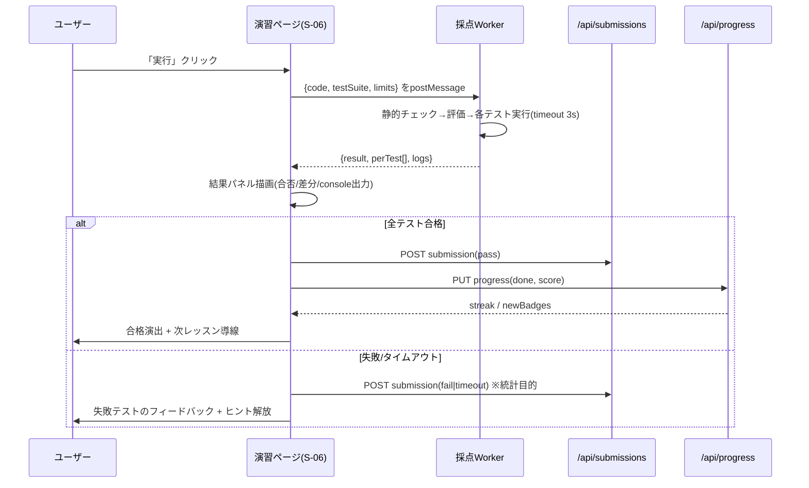

# 詳細設計書

## DDIA Learning Lab — 『Designing Data-Intensive Applications』ハンズオン学習プラットフォーム

| 項目             | 内容                                  |
| ---------------- | ------------------------------------- |
| ドキュメント種別 | 詳細設計書 (Detailed Design Document) |
| バージョン       | 1.0                                   |
| 作成日           | 2026-07-11                            |
| 前提文書         | 01\_基本設計書.md                     |

---

## 1. ディレクトリ構成

```
ddia-learning-lab/
├─ app/
│  └─ [locale]/                     # /ja /en プレフィックスルーティング
│     ├─ layout.tsx                 # NextIntlProvider, Theme, Header
│     ├─ page.tsx                   # S-01 ランディング
│     ├─ learn/
│     │  ├─ page.tsx                # S-02 カリキュラム一覧
│     │  └─ [module]/
│     │     ├─ page.tsx             # S-03 モジュール詳細
│     │     ├─ [lesson]/page.tsx    # S-04 レッスン (MDX描画)
│     │     ├─ quiz/page.tsx        # S-05 クイズ
│     │     └─ lab/[exercise]/page.tsx  # S-06 演習
│     ├─ dashboard/page.tsx         # S-07
│     ├─ glossary/page.tsx          # S-08
│     ├─ search/page.tsx            # S-09
│     ├─ settings/page.tsx          # S-10
│     └─ auth/…                     # S-11
├─ app/api/                         # Route Handlers (REST)
│  ├─ progress/route.ts
│  ├─ submissions/route.ts
│  ├─ notes/route.ts
│  └─ auth/[...nextauth]/route.ts
├─ content/                         # 教材 (Git管理が正)
│  ├─ ja/
│  │  ├─ 01-reliability/
│  │  │  ├─ module.yaml             # モジュールメタ (順序, 所要時間)
│  │  │  ├─ 01-load-and-performance.mdx
│  │  │  ├─ 02-percentiles.mdx
│  │  │  ├─ quiz.yaml
│  │  │  └─ labs/percentile-lab.yaml
│  │  └─ … (02〜12)
│  └─ en/                           # jaと同一slug構造 (CIで整合検証)
├─ components/
│  ├─ viz/                          # 可視化 (章別)
│  │  ├─ LsmTreeViz.tsx
│  │  ├─ HashRingViz.tsx
│  │  ├─ ReplicationLagViz.tsx
│  │  ├─ RaftViz.tsx
│  │  └─ core/                      # 可視化共通基盤 (下記 §8)
│  ├─ lab/                          # 演習UI (エディタ/結果パネル)
│  ├─ mdx/                          # MDXカスタムコンポーネント (Callout等)
│  └─ ui/                           # 汎用UI (Radixラッパ)
├─ lib/
│  ├─ runner/                       # 実行エンジン (§7)
│  │  ├─ jsRunner.ts
│  │  ├─ sqlRunner.ts
│  │  ├─ harness.worker.ts
│  │  └─ grader.ts
│  ├─ content.ts                    # MDX/YAMLローダ (ビルド時)
│  ├─ i18n/ (routing.ts, request.ts)
│  └─ db.ts (Prisma client)
├─ messages/ja.json, en.json        # UI文言カタログ
├─ prisma/schema.prisma
└─ tests/ (unit / e2e)
```

---

## 2. データベース物理設計 (PostgreSQL 16)

### 2.1 テーブル定義

#### users

| カラム                  | 型          | 制約                          | 説明                                                                                                |
| ----------------------- | ----------- | ----------------------------- | --------------------------------------------------------------------------------------------------- |
| id                      | uuid        | PK, default gen_random_uuid() |                                                                                                     |
| email                   | citext      | UNIQUE NOT NULL               |                                                                                                     |
| password_hash           | text        | NULL可                        | OAuthのみの場合NULL。Argon2id(純WASM実装)、workerdで不可の場合はscryptへフォールバック(ADR-007 C-3) |
| display_name            | varchar(50) | NOT NULL                      |                                                                                                     |
| locale_pref             | varchar(5)  | NOT NULL default 'ja'         | 'ja' / 'en'                                                                                         |
| theme_pref              | varchar(10) | default 'system'              |                                                                                                     |
| created_at / updated_at | timestamptz | NOT NULL                      |                                                                                                     |
| deleted_at              | timestamptz | NULL                          | 論理削除 (GDPR即時物理削除ジョブ併用)                                                               |

#### oauth_accounts

| カラム              | 型          | 制約                                  |
| ------------------- | ----------- | ------------------------------------- |
| id                  | uuid        | PK                                    |
| user_id             | uuid        | FK→users, ON DELETE CASCADE           |
| provider            | varchar(20) | 'github' / 'google'                   |
| provider_account_id | text        | UNIQUE(provider, provider_account_id) |

#### progress

| カラム       | 型           | 制約                                  | 説明                           |
| ------------ | ------------ | ------------------------------------- | ------------------------------ |
| id           | uuid         | PK                                    |                                |
| user_id      | uuid         | FK→users, NOT NULL                    |                                |
| item_type    | varchar(10)  | NOT NULL                              | 'lesson' / 'quiz' / 'exercise' |
| item_slug    | varchar(120) | NOT NULL                              | 例 '03-storage/01-hash-index'  |
| status       | varchar(15)  | NOT NULL                              | 'in_progress' / 'done'         |
| score        | smallint     | NULL                                  | クイズ/演習の得点(0-100)       |
| completed_at | timestamptz  | NULL                                  |                                |
| updated_at   | timestamptz  | NOT NULL                              |                                |
| —            | —            | UNIQUE(user_id, item_type, item_slug) | UPSERT用                       |
| —            | —            | INDEX(user_id, updated_at DESC)       | ダッシュボード「続きから」     |

#### submissions

| カラム                     | 型           | 制約              | 説明                                           |
| -------------------------- | ------------ | ----------------- | ---------------------------------------------- |
| id                         | uuid         | PK                |                                                |
| user_id                    | uuid         | FK→users NOT NULL |                                                |
| exercise_slug              | varchar(120) | NOT NULL          |                                                |
| language                   | varchar(10)  | NOT NULL          | 'js' / 'sql'                                   |
| code                       | text         | NOT NULL          | 最大64KB (API側検証)                           |
| result                     | varchar(10)  | NOT NULL          | 'pass' / 'fail' / 'error' / 'timeout'          |
| passed_tests / total_tests | smallint     | NOT NULL          |                                                |
| duration_ms                | int          | NULL              | クライアント計測値(参考)                       |
| client_grader_version      | varchar(20)  | NOT NULL          | 採点ハーネスのバージョン追跡                   |
| created_at                 | timestamptz  | NOT NULL          | INDEX(user_id, exercise_slug, created_at DESC) |

> 採点はクライアント実行のため、`result`は自己申告値である。バッジ・修了証の発行時のみ、提出コードをサーバ側で再実行検証する(§7.5)。

#### notes

| カラム      | 型           | 制約                                   |
| ----------- | ------------ | -------------------------------------- |
| id          | uuid         | PK                                     |
| user_id     | uuid         | FK NOT NULL                            |
| lesson_slug | varchar(120) | NOT NULL, UNIQUE(user_id, lesson_slug) |
| body_md     | text         | 最大32KB                               |
| updated_at  | timestamptz  | NOT NULL                               |

#### badges / user_badges

```
badges(id smallint PK, slug varchar(50) UNIQUE, criteria jsonb)
user_badges(user_id FK, badge_id FK, granted_at timestamptz, PK(user_id, badge_id))
```

#### streaks(学習ストリーク)

```
streaks(user_id PK/FK, current_days int, longest_days int, last_active_date date)
-- 進捗更新API内で日付比較により更新(タイムゾーンはユーザーのIANA TZをクライアントから受領)
```

### 2.2 マイグレーション方針

Prisma Migrateで管理。破壊的変更は expand → migrate → contract の3段階。progressテーブルはslug参照のため、**コンテンツslugのリネームはリダイレクトマップ(`content/redirects.yaml`)+バッチ更新スクリプト**で追随する。

---

## 3. API 詳細設計 (REST / Route Handlers)

共通仕様: `Content-Type: application/json` / 認証はセッションCookie / エラーは RFC 9457 Problem Details 形式 / 状態変更系はCSRFトークン必須 / レート制限: 認証系 5req/min/IP、その他 60req/min/user。

| #   | メソッド/パス                                   | 認証 | 概要                                               |
| --- | ----------------------------------------------- | ---- | -------------------------------------------------- |
| 1   | `GET /api/progress?module={slug}`               | 要   | 自分の進捗取得(モジュール指定 or 全件)             |
| 2   | `PUT /api/progress`                             | 要   | 進捗UPSERT                                         |
| 3   | `POST /api/submissions`                         | 要   | 演習提出記録の登録                                 |
| 4   | `GET /api/submissions?exercise={slug}&latest=1` | 要   | 最新提出の取得(コード復元)                         |
| 5   | `PUT /api/notes/{lessonSlug}`                   | 要   | ノート保存                                         |
| 6   | `GET /api/notes/{lessonSlug}`                   | 要   | ノート取得                                         |
| 7   | `GET /api/dashboard`                            | 要   | サマリ(進捗率/ストリーク/バッジ/続きから)          |
| 8   | `POST /api/certificates`                        | 要   | 修了証発行(サーバ側再検証をキック)                 |
| 9   | `POST /api/guest-progress/import`               | 要   | ゲスト時localStorage進捗の取り込み(初回ログイン時) |

### 3.1 代表I/O定義

**PUT /api/progress**

```jsonc
// Request
{
  "itemType": "exercise",              // "lesson" | "quiz" | "exercise"
  "itemSlug": "06-partitioning/consistent-hash",
  "status": "done",                    // "in_progress" | "done"
  "score": 100,                        // quiz/exercise のみ
  "clientTz": "Asia/Tokyo"             // ストリーク計算用
}
// Response 200
{ "progress": { ...upserted row... }, "streak": { "currentDays": 4 },
  "newBadges": [ { "slug": "part2-complete" } ] }
// 400 validation_error / 401 unauthorized / 409 slug_unknown
```

検証: itemSlugは**ビルド時に生成したslugマニフェスト**(全有効slug集合)に対して照合し、未知slugは409。scoreは0–100。statusの後退(done→in_progress)は無視(冪等・単調)。

**POST /api/submissions**

```jsonc
// Request
{
  "exerciseSlug": "03-storage/kv-store",
  "language": "js",
  "code": "export function put(...) {...}",
  "result": "pass",
  "passedTests": 8,
  "totalTests": 8,
  "durationMs": 412,
  "graderVersion": "1.3.0",
}
// Response 201: { "id": "…" }
// 413 code_too_large (>64KB) / 422 grader_version_unsupported
```

**GET /api/dashboard**

```jsonc
// Response 200
{
  "overall": { "lessonsDone": 21, "lessonsTotal": 46, "exercisesPassed": 7 },
  "modules": [ { "slug": "01-reliability", "percent": 100 }, … ],
  "resume": { "itemType": "lesson", "itemSlug": "05-replication/02-lag",
              "titleKey": "auto-resolved-per-locale" },
  "streak": { "currentDays": 4, "longestDays": 11 },
  "badges": [ { "slug": "part1-complete", "grantedAt": "…" } ]
}
```

### 3.2 シーケンス: 演習提出フロー



---

## 4. 画面詳細設計

### 4.1 S-04 レッスン画面

**レイアウト(デスクトップ ≥1280px)**

```
┌────────────────────────────────────────────────────────────┐
│ Header: ロゴ | Learn | Glossary | 検索 | [JA|EN] | ◐ | 👤 │
├──────────┬──────────────────────────────┬──────────────────┤
│ 左260px  │ 中央 max 72ch                 │ 右280px           │
│ モジュール│ ┌ パンくず                    │ ┌ ページ内目次    │
│ 内目次    │ │ h1 レッスンタイトル          │ │ (h2/h3追随)     │
│ ✓済/●現在│ │ 本文(MDX)                   │ ├ ノート(折畳)   │
│          │ │  ├ 図解/可視化コンポーネント  │ │  Markdown入力   │
│          │ │  ├ <Callout type="info">     │ │  自動保存(2s    │
│          │ │  └ コード例(読み取り専用)     │ │  debounce)      │
│          │ └ [← 前へ] [完了して次へ →]    │ └                │
└──────────┴──────────────────────────────┴──────────────────┘
```

- 「完了して次へ」押下で `PUT /api/progress {status:"done"}` を楽観更新(TanStack Query mutation、失敗時ロールバック+トースト)
- スクロール80%到達で自動的に `in_progress` 記録(ログイン時のみ)
- モバイル(<768px): 左右ペインはドロワー化

**MDXカスタムコンポーネント一覧**
| コンポーネント | props | 用途 |
|---|---|---|
| `<Callout>` | type: info/warn/tip | 注記ボックス |
| `<Figure>` | src, captionKey | 図+キャプション |
| `<Term>` | slug | 用語集ポップオーバー(対訳表示) |
| `<Viz>` | name, preset | 可視化コンポーネントの遅延ロード埋め込み |
| `<CodeBlock>` | lang, runnable? | ハイライト。runnable時は「試す」→ミニ実行 |
| `<QuizInline>` | id | 本文中1問クイズ |
| `<BookRef>` | chapter | 原著該当章の書誌参照カード(引用なし) |

### 4.2 S-06 演習(ラボ)画面

```
┌─────────────────────────────────────────────────────────────┐
│ Header(共通)                                                │
├───────────────────┬─────────────────────────────────────────┤
│ 左 38%(可変)      │ 右 62%                                   │
│ タブ:[課題|ヒント|  │ ┌ Monaco Editor ───────────────────────┐│
│      解説(合格後)] │ │ // テンプレートコード                   ││
│ ・課題文(MDX)     │ │                                        ││
│ ・入出力例         │ └───────────────────────────────────────┘│
│ ・制約(計算量等)   │ ツールバ: [▶ 実行(⌘⏎)] [↺ リセット]      │
│                   │          [提出履歴▾] 自動保存済 ✓         │
│                   ├─────────────────────────────────────────┤
│                   │ 結果パネル(タブ: テスト | コンソール)      │
│                   │ ✓ test 1: put/get roundtrip   (3ms)      │
│                   │ ✗ test 4: overwrite existing key         │
│                   │    期待値: "v2"  実際: "v1"  [差分表示]   │
└───────────────────┴─────────────────────────────────────────┘
```

**状態機械(演習実行)**

```
idle → validating → running → grading → passed | failed | timeout | runtime_error
  └ どの状態からも editing に戻れる(結果は保持)
```

- ドラフト自動保存: localStorage(key: `draft:{exerciseSlug}:{lang}`)へ1s debounce。ログイン時は合格提出のみサーバ保存
- ヒントは段階開放(失敗2回で Hint1、5回で Hint2)。解説タブは合格後 or 「解説を見る(進捗にスキップ記録)」で開放
- SQL演習: エディタ下に**スキーマビューア**(sql.jsのテーブル一覧+サンプル行)を追加表示

### 4.3 S-02 カリキュラム一覧

- 3部をセクション分割、各モジュールをカードで表示(タイトル/所要時間/レッスン数/進捗リング)
- ロック概念は設けない(任意順で学習可)。ただし推奨順を矢印で示す
- ログイン時は `GET /api/progress` を1回取得し、Zustandにキャッシュしてカードへオーバーレイ

### 4.4 S-07 ダッシュボード

- 上段: 「続きから再開」大型カード(直近 in_progress アイテム)
- 中段: Part別進捗バー、ヒートマップ型学習カレンダー(直近12週)、ストリーク
- 下段: バッジグリッド(未取得はシルエット+取得条件)、最近の提出履歴テーブル

---

## 5. i18n 詳細設計

### 5.1 ルーティングと言語解決

```
優先順位: URLプレフィックス > Cookie(NEXT_LOCALE) > Accept-Language > 既定 'en'
```

- `middleware.ts`(next-intl)でプレフィックスなしアクセスを解決先ロケールへ307リダイレクト
- 言語トグル押下時: `usePathname()`から現在ルートを取得→同一slugの他ロケールURLへ`router.replace`→Cookie更新。**演習エディタの内容・実行結果・スクロール位置はZustandに保持しているため遷移後も復元**
- 全ページに `<link rel="alternate" hreflang>` を出力

### 5.2 メッセージカタログ設計(UI文言)

```jsonc
// messages/ja.json (抜粋) — 名前空間: 画面/機能単位
{
  "nav": {
    "learn": "学ぶ",
    "glossary": "用語集",
    "dashboard": "ダッシュボード",
  },
  "lab": {
    "run": "実行",
    "reset": "リセット",
    "testsPassed": "{passed}/{total} 件のテストに合格",
    "timeout": "実行が {sec} 秒を超えたため中断しました",
  },
  "progress": { "resume": "続きから再開", "streakDays": "{days}日連続" },
}
```

規約: キーは `名前空間.要素.状態`。ICU MessageFormatで複数形・変数を処理。ハードコード文字列はESLintルール(`no-literal-jsx-text`)で禁止。

### 5.3 コンテンツ(MDX/YAML)の対管理

- `content/ja/**` と `content/en/**` は**ファイルパス=slug**で1:1対応
- frontmatterに `translationOf` は持たない(パス一致が規約)。代わりに `sourceHash` をENに持たせ、JA原文更新時にCIが「EN未追随」を警告
- 演習定義YAMLはロジック(テスト)を共有し、文言のみ両言語持つ:

```yaml
# content/ja/06-partitioning/labs/consistent-hash.yaml
slug: 06-partitioning/consistent-hash
language: js
entry: "assignKey" # 採点対象のexport関数名
template: | # 初期コード(コメントのみ言語別)
  // ノードのリストとキーを受け取り、担当ノードを返す
  export function assignKey(nodes, key, vnodes = 100) {
    // TODO: 実装
  }
tests: # ← en側yamlと同一内容 (CIでハッシュ一致検証)
  - id: t1
    call: { fn: "assignKey", args: [["a", "b", "c"], "user-42"] }
    assert: { type: "oneOf", value: ["a", "b", "c"] }
  - id: t2
    name:
      {
        ja: "ノード追加時の移動キーが約1/nである",
        en: "~1/n keys move when a node joins",
      }
    kind: property # プロパティベース: 採点ハーネス内で1000キー生成し移動率を検証
    check: "moveRatioNear(1/4, 0.15)"
timeoutMs: 3000
hints:
  - {
      ja: "各ノードをvnodes個の仮想ノードとしてリング上に配置します",
      en: "Place each node as vnodes virtual points on the ring",
    }
```

### 5.4 用語集(Glossary)

`content/glossary.yaml` に一元管理: `{ slug, term: {ja, en}, def: {ja, en}, chapter }`。`<Term slug>` はポップオーバーに**現在言語の定義+もう一方の言語の用語名**を併記(技術英語学習ニーズ対応)。

---

## 6. 状態管理詳細

| 状態                             | 保管先                                                 | 理由                                                                            |
| -------------------------------- | ------------------------------------------------------ | ------------------------------------------------------------------------------- |
| サーバ状態(進捗/提出/ノート)     | TanStack Query(staleTime 60s、進捗mutationは楽観更新)  | キャッシュ・再検証の標準化                                                      |
| エディタ内容・実行結果           | Zustand(`labStore`: slug単位のMap)+ localStorage永続化 | 言語切替・離脱をまたぐ保持                                                      |
| UI状態(ペイン幅/テーマ/目次開閉) | Zustand + localStorage                                 |                                                                                 |
| ゲスト進捗                       | localStorage(`guest-progress` 配列)                    | ログイン時 `POST /api/guest-progress/import` でマージ(サーバ側はdone優先で統合) |
| 言語                             | URL(正)+ Cookie(既定値)                                | SSR一貫性                                                                       |

---

## 7. 実行・採点エンジン詳細(本システムの中核)

### 7.1 JSランナー構成

```
[演習ページ] --postMessage--> [harness.worker.ts (専用Worker)]
     ▲                             │ 1. 静的チェック(禁止トークン: importScripts, fetch, XMLHttpRequest,
     │                             │    Atomics.wait, eval※, new Function※ …)  ※テンプレ許可制
     │ 結果/ログ <--postMessage--  │ 2. サンドボックス初期化: self.fetch等をundefinedに上書き
                                   │ 3. ユーザーコードをBlob URL経由でESM dynamic import
                                   │ 4. テストスイート実行(各テスト個別try/catch, console捕捉)
                                   │ 5. 構造化結果 {perTest[], logs[], durationMs} を返送
[メインスレッド側 jsRunner.ts]
  - Worker生成〜結果待ちを Promise 化
  - ハードタイムアウト: setTimeout(limit+500ms) → worker.terminate() → {result:"timeout"}
  - 毎実行ごとにWorkerを使い捨て(状態汚染防止)
```

- **タイムアウトの二重化**: Worker内部の協調タイムアウト(各テスト3s)+メインスレッドの強制terminate(全体5s)。同期無限ループはterminateで確実に停止
- **メモリ対策**: 結果メッセージは1MB上限(超過時 truncated フラグ)。巨大配列生成はテスト側で検出困難なため、terminate方式を最終防衛線とする
- **console捕捉**: Worker内で`console.log/warn/error`をラップし `{level, args(serialized, 200件上限)}` として返送

### 7.2 採点(grader.ts)

| assert種別          | 内容                                                                                   |
| ------------------- | -------------------------------------------------------------------------------------- |
| equals / deepEquals | 期待値比較(構造比較、NaN/-0対応)。失敗時は簡易diffを生成                               |
| oneOf / matches     | 集合・正規表現                                                                         |
| property            | プロパティベース検証。ハーネス内ヘルパ(`moveRatioNear`等、演習ごとに登録)を実行        |
| complexity(参考)    | 入力サイズ2点の実行時間比から計算量の目安を警告表示(合否には使わない — 環境依存のため) |

部分点: `score = round(passed/total*100)`。`result="pass"` は全テスト合格時のみ。

### 7.3 SQLランナー

- sql.js(SQLite WASM)を**Worker内**でロード(メインスレッドのブロック防止、CDNではなく同一オリジン配信)
- 演習定義の `setupSql`(スキーマ+シードデータ)を新規DBに投入→ユーザーSQLを実行→`expected`(結果集合)と**順序無視/順序考慮**を指定して比較
- 破壊的検証: UPDATE/DELETE課題は実行後のテーブル状態をSELECTで検証
- 逐次実行のみ(トランザクション分離の"体験"はCh7の**専用シミュレータ可視化**で行い、実SQLiteの分離レベルには依存しない)

### 7.4 採点ハーネスのバージョニング

`graderVersion` をsemverで管理し、提出レコードに記録。テスト定義変更時はminor+1し、旧合格は有効のまま(修了証再検証時は最新で再実行)。

### 7.5 修了証発行時のサーバ側再検証

クライアント採点の自己申告リスクに対し、`POST /api/certificates` 受領時のみ:

1. 対象ユーザーの各演習**最新pass提出コード**を取得
2. **GitHub Actions の workflow_dispatch ジョブ**として隔離実行(Node `worker_threads` + 権限制限、CPU/メモリ/時間制限)で同一テストを再実行(ADR-007: ホスティング先のWorkers上では実行しない。非同期発行とし「申請→完了通知」のUXとする)
3. 全合格で証明書PDF生成(Cloudflare R2保存、検証用ID付与)。不一致時は該当演習を`needs_reverify`としてユーザーに再提出案内

---

## 8. 可視化コンポーネント詳細設計

### 8.1 共通基盤 (`components/viz/core`)

| モジュール     | 責務                                                                                                                                                     |
| -------------- | -------------------------------------------------------------------------------------------------------------------------------------------------------- |
| `SimEngine`    | 可視化を「イベント列を発行する純粋な状態機械」として実装するための基底(`step()`, `reset()`, `dispatch(action)`, `subscribe`)。UIと分離し単体テスト可能に |
| `SvgStage`     | viewBox管理、レスポンシブ、pan/zoom(必要時)                                                                                                              |
| `Timeline`     | 再生/一時停止/ステップ実行/速度(0.5–4x)の共通コントロールバー                                                                                            |
| `A11yNarrator` | 状態遷移を `aria-live` テキストで読み上げ(WCAG対応)。各Vizは `describeState(state, locale)` を実装必須                                                   |

### 8.2 個別可視化仕様(抜粋)

**LsmTreeViz(Ch3)**

- 状態: `{ memtable: SortedMap, sstables: Level[][], wal: Entry[] }`
- 操作: put(key,val) / delete(key) / flush / compact(level)
- 表現: memtableは木、SSTableは段組み矩形。コンパクション時は結合アニメーション(framer-motion layoutId)で「同一keyの新しい値が勝つ」を強調
- 演習連動: KVストア実装ラボの合格後、「あなたの実装をLSMに進化させると?」導線

**HashRingViz(Ch6)**

- 状態: `{ nodes: {id, vnodes[]}[], keys: Key[] }`、リング上の角度配置
- 操作: ノード追加/削除、vnodes数スライダー(1–300)、キー1000個一括投入
- 指標パネル: ノードあたりキー数の標準偏差、直近操作での移動キー率 — **演習の期待値(≈1/n)を目で確認できる**

**ReplicationLagViz(Ch5)**

- リーダー1+フォロワー2。書込み/読取りリクエストをユーザーがドロップ、ネットワーク遅延スライダー
- 「自分の書込みが読めない」シナリオボタン → 発生過程をステップ再生 → 対策トグル(リーダー読取り固定/バージョン待ち)で解消を確認

**RaftViz(Ch9)**

- 5ノード。タイマー可視化、ノードクリックで停止/復帰、分断線ドラッグでパーティション作成
- 状態機械はSimEngine上に実装し、選出安全性(同一termに2リーダー不在)を単体テストで担保
- 課題モード: 「このクラスタでコミット可能な最小生存ノード数は?」等の問いに可視化を操作して回答

**IsolationViz(Ch7)**

- 2トランザクションのタイムラインをドラッグで並べ替え、分離レベル選択で結果(読める値/ブロック/アボート)が変化
- ダーティリード/読取りスキュー/書込みスキュー/ファントムのプリセットシナリオ

---

## 9. コンテンツビルドパイプライン

```
content/**  ──(build)──▶ 検証 ─▶ 生成物
検証:
  1. ja/en slug集合の一致 (差分あればビルド失敗)
  2. 演習YAMLのtestsハッシュ両言語一致
  3. MDX: 使用コンポーネントのprops型検査 / リンク切れ検査
  4. frontmatter必須項目 (title, order, minutes)
生成物:
  - slugマニフェスト(API検証用 JSON)
  - 検索インデックス(ロケール別 FlexSearch、静的JSON分割)
  - 目次ツリー(S-02/S-03用)
```

CI(GitHub Actions): lint → typecheck → unit(SimEngine/grader) → content-validate → build → Playwright(主要フロー: 学習完了/演習合格/言語切替でエディタ保持)。

---

## 10. エラーハンドリング / ログ

| 事象                                | ユーザー向け挙動                                              | 記録                       |
| ----------------------------------- | ------------------------------------------------------------- | -------------------------- |
| Worker初期化失敗(WASM/Worker非対応) | 演習を読み取り専用モード+模範解説へフォールバック、案内バナー | Sentryにcapability情報     |
| 採点タイムアウト                    | 「無限ループの可能性」+該当テスト入力を提示                   | submission(result=timeout) |
| API 401(セッション失効)             | 進捗はlocalStorageに退避→再ログイン後に自動同期               | —                          |
| API 5xx                             | トースト+指数バックオフ再試行(mutationは最大3回)              | Sentry                     |
| MDX描画エラー                       | Error Boundaryで該当セクションのみ差替(ページ全体は生存)      | Sentry + slug              |

ログ方針: サーバはpinoで構造化ログ(PIIはemailをマスク)。提出コードは分析目的の閲覧を行わない(利用規約に明記)。

---

## 11. テスト設計

| レベル | 対象                 | 代表ケース                                                             |
| ------ | -------------------- | ---------------------------------------------------------------------- |
| 単体   | grader.ts            | deepEqualsのエッジ(NaN, 循環参照拒否)、部分点計算                      |
| 単体   | SimEngine各Viz       | Raft: 同一termダブルリーダー不成立 / LSM: コンパクション後の最新値優先 |
| 単体   | slugマニフェスト検証 | 未知slug 409、リダイレクトマップ適用                                   |
| 結合   | jsRunner+Worker      | 無限ループ→terminate→timeout結果、console 200件打ち切り                |
| 結合   | i18nルーティング     | Cookie/Accept-Language解決、hreflang出力                               |
| E2E    | 学習主要動線         | サインアップ→レッスン完了→演習合格→ダッシュボード反映                  |
| E2E    | 言語切替             | 演習中に切替→コード・結果保持、URL/文言切替                            |
| E2E    | ゲスト→ログイン      | localStorage進捗のマージ                                               |
| a11y   | axe自動 + 手動       | Viz操作のキーボード完結、aria-liveナレーション                         |

---

## 12. 未決事項 / 実装フェーズへの申し送り

1. **EN教材の制作体制**: JA原文→EN翻訳のレビュー担当と用語統一表(glossary.yamlを正とする)の運用確定
2. **サーバ側再検証基盤**(§7.5)の実行環境選定: MVPでは修了証機能を後回しにし、Phase 3で導入する判断も可
3. Pyodide(Python演習)導入可否 — バンドルサイズ(+10MB超)とロード時間のトレードオフ評価をPhase 2で実施
4. 検索のホスティング: 静的FlexSearchで開始し、コンテンツ増加時にサーバ検索へ移行する閾値(インデックス>5MB)を目安とする
