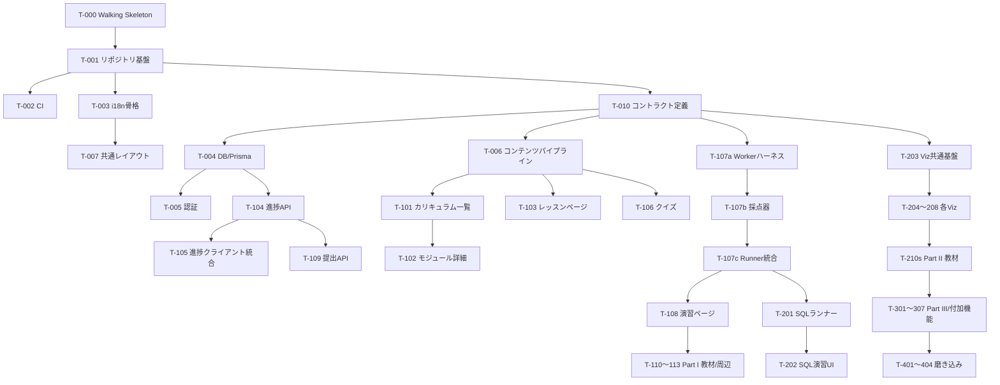

# 実装タスク分割書 (WBS)

## DDIA Learning Lab — Claude Sonnet 向け実装タスク定義

| 項目         | 内容                                                                     |
| ------------ | ------------------------------------------------------------------------ |
| バージョン   | 1.0                                                                      |
| 前提文書     | 01*基本設計書.md / 02*詳細設計書.md(以下「設計書」。§番号は02の章を指す) |
| 実装担当     | Claude Sonnet(Claude Code 上での自律実装を想定)                          |
| 対となる文書 | 04_AI実装指示フロー・プロンプト集.md                                     |

---

## 0. タスク分割の設計原則

Sonnetが完走するための粒度・構造は以下の原則で決定している。**この原則自体がWBSの仕様**であり、タスク追加時も必ず従うこと。

| #   | 原則                                                                                                     | 理由                                                                             |
| --- | -------------------------------------------------------------------------------------------------------- | -------------------------------------------------------------------------------- |
| P1  | **1タスク = 1セッション = 1ブランチ/PR**。変更ファイル ~15個以内、実装時間換算で人間の0.5〜2日相当を上限 | コンテキスト逼迫と方針ドリフトを防ぐ。セッションを跨ぐタスクは失敗率が跳ね上がる |
| P2  | **全タスクに機械検証可能な受入基準(コマンド)を必ず定義**                                                 | 「できたつもり」を排除。Sonnetは自己申告で完了宣言しがち                         |
| P3  | **依存は明示的なDAGで管理し、依存先の成果物(ファイル/型)を入力として列挙**                               | 存在しないAPIの妄想実装(hallucination)を防ぐ                                     |
| P4  | **インターフェース定義タスクを実装タスクから分離**(例: 型・YAMLスキーマ・APIコントラクトを先に確定)      | 並行タスク間の不整合を構造的に防ぐ                                               |
| P5  | **コンテンツ(教材)とコード(機能)は別タスク**                                                             | 性質が違う(執筆 vs 実装)。混ぜるとレビュー不能になる                             |
| P6  | **各タスクに「やらないこと(Out of Scope)」を明記**                                                       | Sonnetのスコープクリープ(頼んでいないリファクタ・機能追加)を抑止                 |
| P7  | 中核リスク(実行エンジン、i18n基盤)は**垂直スライスで最初に貫通**(T-000 Walking Skeleton)                 | 統合リスクを最初に潰す                                                           |

**サイズ表記**: S(〜0.5日相当)/ M(〜1日)/ L(〜2日)。Lを超える分割不能タスクは存在させない。

---

## 1. 全体依存関係 (DAG)

---

## 2. Phase 0: 基盤(直列実行推奨)

### T-000 Walking Skeleton【最重要・最初に実行】

| 項目          | 内容                                                                                                                                                                              |
| ------------- | --------------------------------------------------------------------------------------------------------------------------------------------------------------------------------- |
| 目的          | 「/ja と /en でレッスン1本が表示され、1つのJS演習をWorkerで実行・採点できる」最小貫通を作る。**本タスクの成果物は後続で作り直してよい(使い捨て許容)**。目的は統合リスクの早期検出 |
| サイズ / 依存 | L / なし                                                                                                                                                                          |
| 参照設計      | 02 §7.1(実行エンジン)、§5.1(i18nルーティング)                                                                                                                                     |
| 成果物        | Next.js最小アプリ、ダミーMDX 1本(ja/en)、harness.workerの原型、動作確認手順書 `docs/skeleton-notes.md`                                                                            |
| 受入基準      | `npm run dev` で /ja/demo /en/demo が表示切替可能。デモ演習で「正解コード→pass」「無限ループ→5s以内にtimeout」の両方を手動確認し、確認結果をnotesに記録                           |
| Out of Scope  | DB、認証、スタイリング、テスト整備                                                                                                                                                |
| Sonnet注意点  | 綺麗に作り込まないこと。「動く貫通」以外の作業を一切禁止                                                                                                                          |

### T-001 リポジトリ基盤整備

| 項目          | 内容                                                                                                                                                                                           |
| ------------- | ---------------------------------------------------------------------------------------------------------------------------------------------------------------------------------------------- |
| 目的          | 本番リポジトリの初期化(T-000とは別に新規作成)                                                                                                                                                  |
| サイズ / 依存 | M / T-000(知見の反映のみ)                                                                                                                                                                      |
| 成果物        | Next.js 15 + TypeScript strict + Tailwind + ESLint(`no-literal-jsx-text`等 設計書§5.2のルール含む)+ Prettier + Vitest + ディレクトリ骨格(02 §1どおり)+ `CLAUDE.md`(04文書のテンプレートを配置) |
| 受入基準      | `npm run lint && npm run typecheck && npm run test && npm run build` が全て成功(テストはサンプル1件)                                                                                           |
| Out of Scope  | 機能実装、i18n、DB                                                                                                                                                                             |

### T-002 CIパイプライン

サイズS / 依存T-001。GitHub Actionsで lint→typecheck→unit→build を実行するワークフローを作成。受入: PR作成でCIが走り緑になること(ローカルでは `act` 相当の検証 or ワークフローYAMLのスキーマ検証+全コマンドのローカル成功で代替可)。content-validate と E2E のジョブ枠は placeholder(`if: false`)で先に定義しておく。

### T-003 i18n骨格

| 項目          | 内容                                                                                                                                                                   |
| ------------- | ---------------------------------------------------------------------------------------------------------------------------------------------------------------------- |
| 目的          | next-intlによる `/ja` `/en` ルーティング、言語解決、UIカタログ、言語トグル                                                                                             |
| サイズ / 依存 | M / T-001                                                                                                                                                              |
| 参照設計      | 02 §5.1, §5.2                                                                                                                                                          |
| 成果物        | `middleware.ts`(解決優先順位: URL>Cookie>Accept-Language>en)、`messages/ja.json` `en.json`(nav名前空間のみ)、`<LocaleToggle>`(Cookie更新+同一ルート遷移)、hreflang出力 |
| 受入基準      | 単体テスト: 言語解決ロジック4ケース(URL指定/Cookieのみ/ヘッダのみ/無指定)。手動: `/` アクセスで適切なロケールへ307                                                     |
| Out of Scope  | コンテンツのi18n、Zustandによる状態保持(T-108で実施)                                                                                                                   |

### T-010 コントラクト定義【インターフェース確定タスク】

| 項目          | 内容                                                                                                                                                                                                                          |
| ------------- | ----------------------------------------------------------------------------------------------------------------------------------------------------------------------------------------------------------------------------- |
| 目的          | 後続の並行実装が依存する**全インターフェースを型として先に確定**する                                                                                                                                                          |
| サイズ / 依存 | M / T-001                                                                                                                                                                                                                     |
| 参照設計      | 02 §2(DB)、§3(API I/O)、§5.3(演習YAML)、§7(Runnerメッセージ)、§8.1(SimEngine)                                                                                                                                                 |
| 成果物        | `lib/contracts/` 配下に: ① API I/O型(zodスキーマ+型)、② 演習YAML zodスキーマ、③ Worker⇄Main メッセージ型(`RunRequest`/`RunResult`)、④ `SimEngine<S,A>` インターフェース、⑤ slugマニフェスト型。各型にJSDocで設計書該当§を記載 |
| 受入基準      | typecheck成功。zodスキーマの正常系/異常系パーステスト各1件以上。**このタスク以降、contracts変更は専用タスクでのみ許可**(CLAUDE.mdに明記)                                                                                      |
| Out of Scope  | 実装(型と検証のみ)                                                                                                                                                                                                            |

### T-004 DB/Prisma

サイズM / 依存T-010。02 §2の全テーブルを `schema.prisma` 化、初回migration、開発用seed(ユーザー2名+進捗数件)、`lib/db.ts`。受入: `prisma migrate dev` 成功、seed投入後にPrisma経由でCRUDする統合テスト(テスト用DBはdocker-compose定義を含める)が通ること。UNIQUE制約・INDEXが設計書と一致していることをmigration SQLで確認しPRに差分引用。

### T-005 認証

サイズM / 依存T-004。Auth.js(Credentials: Argon2id + GitHub/Google OAuth)、セッションCookie(HTTPOnly, SameSite=Lax)、`/ja/auth/*` 画面(S-11)。受入: サインアップ→ログイン→セッション取得のAPI統合テスト。レート制限(5req/min/IP)のミドルウェアテスト。OAuthは環境変数未設定時にUI非表示となること。

### T-006 コンテンツビルドパイプライン

| 項目          | 内容                                                                                                                                                                                                                                                                                                         |
| ------------- | ------------------------------------------------------------------------------------------------------------------------------------------------------------------------------------------------------------------------------------------------------------------------------------------------------------ |
| 目的          | MDX/YAMLローダ、slugマニフェスト生成、両言語整合検証(02 §9)                                                                                                                                                                                                                                                  |
| サイズ / 依存 | L / T-010                                                                                                                                                                                                                                                                                                    |
| 成果物        | `lib/content.ts`(ビルド時ロード、frontmatter検証)、`scripts/validate-content.ts`(①ja/en slug集合一致 ②演習testsハッシュ一致 ③リンク切れ ④frontmatter必須項目)、slugマニフェストJSON生成、CIのcontent-validateジョブ有効化、**検証用フィクスチャ**(正常系1モジュール+異常系: slug欠落/tests不一致/リンク切れ) |
| 受入基準      | `npm run validate:content` が正常フィクスチャで成功し、3種の異常フィクスチャそれぞれで**特定可能なエラーメッセージ**(ファイルパス+原因)を出して失敗すること(テストで担保)                                                                                                                                    |
| Out of Scope  | 実教材の執筆                                                                                                                                                                                                                                                                                                 |

### T-007 共通レイアウト

サイズM / 依存T-003。Header(ロゴ/ナビ/言語トグル/テーマ切替/アカウントメニュー)、ダーク・ライトテーマ、フッタ、404/エラーページ、Error Boundary方針(02 §10)。受入: axe自動チェックで重大違反0、キーボードのみでヘッダ全操作可能(Playwrightテスト1本)。

---

## 3. Phase 1: MVP(T-010完了後は並行可能なレーンを明記)

**並行レーン**: A=画面系(T-101→102→103→105→106)、B=API系(T-104→109)、C=実行エンジン(T-107a→b→c→108)。レーン間の待ち合わせはDAG参照。

### T-101 カリキュラム一覧 (S-02)

サイズM / 依存T-006, T-007。module.yamlスキーマ(T-010の型)に基づく一覧描画、Part区切り、進捗リング(この時点ではprops注入のみ、実データはT-105)。受入: フィクスチャ12モジュールが順序どおり両言語で描画されるスナップショットテスト。

### T-102 モジュール詳細 (S-03)

サイズS / 依存T-101。レッスン/クイズ/演習の目次、所要時間合計、次アイテム導線。受入: フィクスチャに対する描画テスト+存在しないslugで404。

### T-103 レッスンページ (S-04)

| 項目          | 内容                                                                                                                                                                                                                                       |
| ------------- | ------------------------------------------------------------------------------------------------------------------------------------------------------------------------------------------------------------------------------------------ |
| サイズ / 依存 | L / T-006, T-007                                                                                                                                                                                                                           |
| 参照設計      | 02 §4.1                                                                                                                                                                                                                                    |
| 成果物        | 3カラムレイアウト(左目次/本文/右ページ内目次)、MDXカスタムコンポーネント7種(`Callout` `Figure` `Term` `Viz`(遅延ロード枠のみ) `CodeBlock` `QuizInline` `BookRef`)、モバイルドロワー化、スクロール80%検知(コールバックのみ、API接続はT-105) |
| 受入基準      | 各カスタムコンポーネントの描画テスト。`Viz` は未登録名でError Boundaryにフォールバックすること。Lighthouse(ローカル)でLCP関連の明らかな退行がないこと                                                                                      |
| Out of Scope  | ノート機能(T-307)、進捗API接続                                                                                                                                                                                                             |

### T-104 進捗API

サイズM / 依存T-004, T-006。`PUT/GET /api/progress`、slugマニフェスト照合(未知slug→409)、statusの単調性(done→in_progressは無視)、ストリーク更新、Problem Details形式エラー、CSRF。受入: **API統合テストで02 §3.1の仕様表を1ケース=1テストで網羅**(正常/400/401/409/単調性/ストリーク日跨ぎ)。

### T-105 進捗クライアント統合

サイズM / 依存T-101〜104。TanStack Query導入、進捗取得のZustandキャッシュ、「完了して次へ」楽観更新+失敗ロールバック、S-02/S-03への進捗オーバーレイ、スクロール80%で in_progress。受入: msw(モックサーバ)でのmutation成功/失敗/ロールバックのコンポーネントテスト。

### T-106 クイズ (S-05)

サイズM / 依存T-006, T-105。quiz.yaml描画、単一/複数選択、即時フィードバック+解説、スコア計算→進捗API送信。受入: 採点ロジック単体テスト(全問/部分/0点)、キーボード操作可能。

### T-107a Workerハーネス(サンドボックス)

| 項目          | 内容                                                                                                                                                                  |
| ------------- | --------------------------------------------------------------------------------------------------------------------------------------------------------------------- |
| サイズ / 依存 | M / T-010                                                                                                                                                             |
| 参照設計      | 02 §7.1 手順1〜3, 5                                                                                                                                                   |
| 成果物        | `harness.worker.ts`: 静的チェック(禁止トークン、テンプレ許可制)、`fetch`等の無効化、Blob URL経由ESM import、console捕捉(200件上限)、構造化結果返送(1MB上限+truncated) |
| 受入基準      | Vitest(worker環境 or jsdom+モック)で: 禁止トークン検出/console上限/結果サイズ上限/import失敗時のerror返送 の各テスト                                                  |
| Out of Scope  | 採点ロジック(107b)、terminate(107c)                                                                                                                                   |

### T-107b 採点器 (grader)

サイズM / 依存T-107a。02 §7.2の4種assert(equals/deepEquals/oneOf・matches/property/complexity参考表示)、部分点計算、失敗時diff生成、演習別ヘルパ登録機構(`moveRatioNear`等)。受入: **assertごとのエッジケーステーブル駆動テスト**(NaN, -0, 循環参照は拒否, 深いネスト)。graderVersion定数の導入。

### T-107c Runner統合

サイズM / 依存T-107b。`jsRunner.ts`: Worker使い捨て生成、Promise化、二重タイムアウト(内部3s/外部terminate 5s)、`RunResult` 返却。受入: **結合テスト「while(true){}を渡すと5.5s以内にtimeout結果が返り、Workerが残存しない」**を必須で含む。正常系・実行時例外・タイムアウトの3系統。

### T-108 演習ページ (S-06)

| 項目          | 内容                                                                                                                                                                                                                                                            |
| ------------- | --------------------------------------------------------------------------------------------------------------------------------------------------------------------------------------------------------------------------------------------------------------- |
| サイズ / 依存 | L / T-107c, T-007                                                                                                                                                                                                                                               |
| 参照設計      | 02 §4.2, §6                                                                                                                                                                                                                                                     |
| 成果物        | Monaco統合(SSR回避の動的import)、3ペイン(幅ドラッグ可変)、状態機械(idle→…→passed等)、結果パネル(テスト/コンソール タブ、diff表示)、ドラフトlocalStorage自動保存(1s debounce)、ヒント段階開放(失敗2回/5回)、⌘⏎実行、**言語切替時のエディタ・結果保持**(labStore) |
| 受入基準      | 状態機械の単体テスト(全遷移)。Playwright: 「コード入力→実行→合格表示」「言語トグル→コードが保持されている」の2本                                                                                                                                                |
| Out of Scope  | SQL演習(T-202)、提出API接続はスタブ→T-109完了後に接続コミットを含めてよい                                                                                                                                                                                       |

### T-109 提出API

サイズS / 依存T-104。`POST /api/submissions` `GET(latest)`、64KB制限(413)、graderVersion検証(422)、S-06への接続(合格時にsubmission+progress送信、02 §3.2シーケンス)。受入: API統合テスト(201/413/422)+シーケンスのE2E1本。

### T-110〜111 Part I 教材(コンテンツタスク・8本に分割)

モジュールごとに「JA執筆(T-110-1〜4)」→「EN翻訳(T-111-1〜4)」を独立タスク化。各サイズM。

- 成果物: レッスンMDX 3〜5本、quiz.yaml(5〜8問)、演習YAML 1〜2本(テスト定義含む)、glossary.yamlへの用語追加
- 受入基準: `validate:content` 成功、演習は**模範解答コードがgraderでpassすること**をテストとして同梱(`labs/__solutions__/`、本番ビルドから除外)、原著本文の引用が含まれないこと(レビュー観点としてPR本文でチェックリスト宣言)
- 執筆ガイドライン(トーン、見出し構造、`<BookRef>`必須)は最初のT-110-1で `docs/content-style-guide.md` として確立し、以降のタスクが参照

### T-112 ダッシュボード (S-07)

サイズM / 依存T-104, T-005。`GET /api/dashboard` 実装+画面(続きから/Part別進捗/ヒートマップ/ストリーク)。受入: API統合テスト+描画テスト。バッジ枠はシルエットのみ(T-303)。

### T-113 ゲスト進捗

サイズS / 依存T-104。localStorage進捗、初回ログイン時の `POST /api/guest-progress/import`(done優先マージ)。受入: マージロジックのテーブル駆動テスト(両方done/片方のみ/競合)。

---

## 4. Phase 2: 分散データ編

### T-201 SQLランナー

サイズM / 依存T-107c。sql.jsをWorker内ロード(同一オリジン配信設定含む)、setupSql投入→ユーザーSQL実行→結果集合比較(順序有無指定)、破壊的課題の事後SELECT検証(02 §7.3)。受入: 正常/構文エラー/期待不一致/順序無視比較 のテスト。

### T-202 SQL演習UI

サイズS / 依存T-201, T-108。S-06にSQLモード追加(Monaco言語切替、スキーマビューア)。受入: Playwright1本(SQL演習の合格フロー)。

### T-203 Viz共通基盤

| 項目          | 内容                                                                                                                                                                            |
| ------------- | ------------------------------------------------------------------------------------------------------------------------------------------------------------------------------- |
| サイズ / 依存 | M / T-010                                                                                                                                                                       |
| 参照設計      | 02 §8.1                                                                                                                                                                         |
| 成果物        | `SimEngine`実装(step/reset/dispatch/subscribe、決定的乱数注入)、`SvgStage`、`Timeline`(再生/停止/ステップ/速度)、`A11yNarrator`(aria-live、`describeState(state, locale)` 規約) |
| 受入基準      | SimEngineの単体テスト(購読通知/リセット/決定性: 同一シード同一結果)。ダミーVizでTimeline操作のコンポーネントテスト                                                              |

### T-204〜208 各可視化(各サイズL、T-203依存、相互独立=並行可)

| ID    | Viz               | 必須テスト(合否基準)                                               |
| ----- | ----------------- | ------------------------------------------------------------------ |
| T-204 | LsmTreeViz        | コンパクション後に同一keyの最新値のみ残る/削除トゥームストーン処理 |
| T-205 | HashRingViz       | vnodes増で標準偏差が単調減少傾向/ノード追加時の移動率が理論値±15%  |
| T-206 | ReplicationLagViz | read-your-writes違反シナリオが決定的に再現/対策トグルで違反0       |
| T-207 | RaftViz           | 同一termに2リーダー不成立/分断時に少数側がコミット不能             |
| T-208 | IsolationViz      | 4プリセット(ダーティリード等)が各分離レベルで設計書どおりの結果    |

共通受入: SimEngineロジックの単体テスト(上表)、`describeState` 両言語実装、キーボード操作可能、`<Viz name>` 経由でMDXから遅延ロードされること。

### T-210〜219 Part II 教材(5モジュール × JA/EN = 10タスク)

T-110系と同一フォーマット。演習: レプリケーションラグ対策実装(Ch5)、コンシステントハッシュ(Ch6)、クォーラム計算(Ch9)ほか。依存: 対応するVizタスク完了後(教材が `<Viz>` を参照するため)。

---

## 5. Phase 3: 派生データ編・付加機能

| ID    | タスク                                   | サイズ | 依存          | 受入基準の要点                                                                                                  |
| ----- | ---------------------------------------- | ------ | ------------- | --------------------------------------------------------------------------------------------------------------- |
| T-301 | Part III 教材(3モジュール×JA/EN=6タスク) | 各M    | T-108         | T-110系と同一                                                                                                   |
| T-302 | キャップストーン(分岐シナリオエンジン)   | L      | T-006         | シナリオYAMLスキーマ+分岐評価の単体テスト、1シナリオ完走E2E                                                     |
| T-303 | バッジ                                   | S      | T-104         | 付与条件(criteria jsonb)評価のテーブル駆動テスト、進捗API応答への `newBadges` 統合                              |
| T-304 | 修了証+サーバ側再検証                    | L      | T-303, T-107c | worker_threads隔離実行(CPU/メモリ/時間制限)の結合テスト、改ざんコード(実は不合格)で `needs_reverify` になること |
| T-305 | 用語集 (S-08)                            | S      | T-006         | glossary.yaml描画、`<Term>` ポップオーバー対訳表示テスト                                                        |
| T-306 | 検索 (S-09)                              | M      | T-006         | ロケール別FlexSearchインデックス生成、日本語トークナイズの検索ヒットテスト                                      |
| T-307 | ノート機能                               | M      | T-104         | 2s debounce自動保存、DOMPurifyサニタイズのXSSテスト(script注入が無害化)                                         |

---

## 6. Phase 4: 磨き込み

| ID    | タスク               | サイズ | 受入基準                                                                                                        |
| ----- | -------------------- | ------ | --------------------------------------------------------------------------------------------------------------- |
| T-401 | a11y監査対応         | M      | 全画面axe重大違反0、Viz含む主要動線のキーボード完結E2E                                                          |
| T-402 | 性能最適化           | M      | Lighthouse: 主要3画面でLCP≤2.5s(CI計測)、Monaco/sql.js/Vizのバンドル分離確認(`next build` の分析出力をPRに添付) |
| T-403 | E2E拡充              | M      | 02 §11のE2E表を全件実装、CIで安定(3回連続成功)                                                                  |
| T-404 | EN校閲・整合最終確認 | M      | sourceHash警告0、用語がglossary.yamlと一致(検証スクリプト追加)                                                  |

---

## 7. タスクサマリ

| Phase      | タスク数 | 内訳                                             |
| ---------- | -------- | ------------------------------------------------ |
| 0 基盤     | 9        | T-000〜007, T-010                                |
| 1 MVP      | 17       | 機能11 + 教材(Part I)6 ※T-110/111は計8サブタスク |
| 2 分散編   | 17       | 機能7 + 教材10                                   |
| 3 派生編   | 13       | 機能7 + 教材6                                    |
| 4 磨き込み | 4        |                                                  |
| **計**     | **約60** | すべて1セッション完結サイズ                      |
