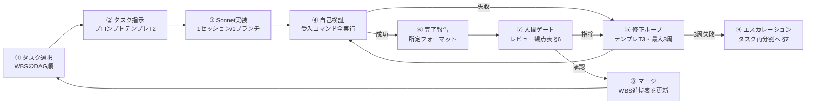

# AI実装指示フロー・プロンプト集

## DDIA Learning Lab — Claude Sonnet を完走させるための運用手順書

| 項目       | 内容                                                                            |
| ---------- | ------------------------------------------------------------------------------- |
| バージョン | 1.0                                                                             |
| 前提文書   | 01*基本設計書.md / 02*詳細設計書.md / 03\_実装タスク分割書.md(以下WBS)          |
| 想定環境   | Claude Code(Sonnet)。参考: https://docs.claude.com/en/docs/claude-code/overview |

---

## 1. 運用モデル全体像



**鉄則**

1. **1タスク=1セッション=1ブランチ=1PR**。セッションを跨いだら、続きは「新規セッション+T2プロンプト再投入」で行う(前セッションの記憶に依存させない)
2. **すべての文脈はリポジトリ内のファイルで渡す**(設計書は `docs/design/` に格納)。チャット履歴を仕様の保管場所にしない
3. 人間の役割は「タスク投入・PRレビュー・エスカレーション判断」の3点のみ。コード修正はSonnetに差し戻す

---

## 2. 事前準備(人間が最初に1回だけ行う)

1. 空リポジトリ作成、`docs/design/` に 01〜03 の設計文書を配置
2. リポジトリ直下に **`CLAUDE.md`**(§3のテンプレート)を配置 — Sonnetが毎セッション自動で読む憲法
3. `docs/tasks/STATUS.md`(§8の進捗表)を配置
4. T-000(Walking Skeleton)から §4-T2 のテンプレートで投入開始

---

## 3. CLAUDE.md テンプレート(リポジトリ直下に配置)

```markdown
# CLAUDE.md — DDIA Learning Lab 実装憲法

## プロジェクト概要

DDIA(分散データシステム)の概念を学ぶバイリンガル(ja/en)学習Webアプリ。
仕様の正: docs/design/01*基本設計書.md, 02*詳細設計書.md
タスク定義の正: docs/design/03\_実装タスク分割書.md
現在の進捗: docs/tasks/STATUS.md

## 絶対規則(違反はレビューで差し戻し)

1. 指示されたタスクID(T-xxx)のスコープのみ実装する。Out of Scope欄の作業、
   頼まれていないリファクタ・依存追加・機能追加を行わない。
2. lib/contracts/ 配下の型・スキーマは変更禁止(変更が必要なら実装を止めて
   その旨を報告し、指示を待つ)。
3. モック・スタブ・TODOコメントで「実装したことにする」の禁止。受入基準を
   満たせない場合は、満たせない理由を報告して止まる。
4. テストを弱めて(expect緩和・skip・timeout延長)通すことの禁止。
5. UI文言のハードコード禁止。必ず messages/{ja,en}.json に両言語追加する。
   コンテンツ系ファイルは ja/en を必ず対で作成・更新する。
6. 教材・コメント・テストデータに原著『Designing Data-Intensive Applications』
   本文の引用・翻訳を含めない(トピックの独自解説のみ)。
7. 秘密情報(.env)をコミットしない。

## 開発コマンド(完了宣言前に全て成功させること)

- npm run lint / npm run typecheck / npm run test
- npm run validate:content # T-006以降
- npm run build
- npm run test:e2e # E2Eを含むタスクのみ

## コーディング規約(要点)

- TypeScript strict。any禁止(やむを得ない場合は理由コメント必須)
- サーバ状態=TanStack Query / クライアント状態=Zustand(docs/design/02 §6)
- API エラーは RFC 9457 Problem Details(docs/design/02 §3)
- コミット: Conventional Commits。1論理変更=1コミット

## 完了報告フォーマット(タスク終了時に必ずこの形式で出力)

1. 実装サマリ(3行以内)
2. 変更ファイル一覧と各1行説明
3. 受入基準との対応表(基準→検証コマンド→結果)
4. 実行したコマンドの生ログ(最終成功分)
5. スコープ外と判断して実施しなかったこと
6. 設計との差異・懸念(なければ「なし」)
```

---

## 4. プロンプトテンプレート集

### T1: セッション開始・タスク投入前の状況同期(毎セッション冒頭)

```text
docs/tasks/STATUS.md と docs/design/03_実装タスク分割書.md を読み、
次に着手すべきタスク候補を依存関係(DAG)に基づいて1つ提案してください。
まだ実装は開始しないでください。
```

※人間が投入タスクを決めている場合はT1を省略しT2から。

### T2: タスク実行指示(基本形 — これを毎タスク使う)

```text
タスク T-104(進捗API)を実装してください。

## 手順(この順で進めること)
1. docs/design/03_実装タスク分割書.md の T-104 の定義(目的/成果物/受入基準/
   Out of Scope)を読み、参照設計として docs/design/02_詳細設計書.md の
   §2.1(progressテーブル)と §3.1(PUT /api/progress の仕様)を読む。
2. 依存タスクの成果物を確認する: lib/contracts/(API型)、prisma/schema.prisma、
   lib/content.ts のslugマニフェスト出力。存在しない・型が合わない場合は
   実装せずに報告して止まる。
3. 実装計画(作成/変更ファイル一覧と各テスト方針)を提示する。
   → 私が「承認」と返すまで実装を開始しない。
4. 承認後: ブランチ feat/T-104-progress-api を作成し、テストを先に書いてから実装する。
5. 受入基準のコマンドを全て実行し、CLAUDE.md の完了報告フォーマットで報告する。

## 制約
- スコープはWBSのT-104定義に完全準拠。関連して気づいた改善は実装せず
  報告6項に記載のみ。
```

**ポイント**: ③の計画承認ゲートは、複雑タスク(サイズM以上)では必須。Sサイズは省略可(「計画提示は不要、直ちに実装」と明記)。

### T3: 修正ループ(受入失敗・レビュー指摘時)

```text
以下の指摘を修正してください。修正は指摘事項のみに限定し、
他のコードに触れないこと。

## 指摘
1. [具体的な失敗テスト名/エラーログ/レビューコメントを貼る]

## 完了条件
- 上記に対応するテストが成功し、既存テストが全て成功していること
- 何を・なぜ変えたかを差分単位で説明すること
```

**運用ルール**: 同一タスクで修正ループは**3周まで**。3周で収束しない場合は §7 エスカレーションへ。ループ中に「ついでの修正」が混ざったら即差し戻す。

### T4: コンテンツ執筆タスク専用(T-110系)

```text
タスク T-110-3(Part I モジュール3「ストレージとインデックス」JA教材)を
作成してください。

## 手順
1. docs/content-style-guide.md(執筆規約)と、既存の完成モジュール
   content/ja/01-reliability/ を模範例として読む。
2. WBSのT-110-3定義とカリキュラム表(docs/design/01 §3)のモジュール3の
   トピック・演習仕様を読む。
3. レッスン構成案(各レッスンのタイトルと見出しレベルの骨子、演習のテスト
   ケース一覧)を提示 → 承認後に執筆。
4. 演習YAMLには模範解答を labs/__solutions__/ に置き、grader で pass する
   テストを同梱する。

## 品質基準
- 原著本文の引用・翻訳は一切含めない(独自解説)。各レッスン末尾に
  <BookRef chapter={3}> を置く。
- コード例は全て実行可能であること(コピペで動く)。
- 専門用語の初出には <Term> を使い、glossary.yaml に ja/en 両方を追加する。
```

### T5: 統合検証タスク(各Phase完了時に1回)

```text
Phase 1 の統合検証を行ってください。実装・修正は行わず、検証と報告のみ。

1. npm run lint && npm run typecheck && npm run test &&
   npm run validate:content && npm run build && npm run test:e2e を実行
2. docs/design/02_詳細設計書.md の §3(API仕様)・§4(画面仕様)と実装を突合し、
   差異を「仕様側が正/実装側が正/要判断」に分類した表を作成
3. docs/tasks/STATUS.md を現状に合わせて更新する提案を出す
```

### T6: セッション断絶からの復帰

```text
前セッションでタスク T-108 が途中終了しました。
1. git status / git log --oneline -10 / ブランチ差分を確認し、
   現在の到達点をWBSのT-108受入基準に対して評価してください。
2. 残作業のリストを提示し、承認後に続行してください。
   前セッションの判断は差分から読み取れるもののみを信頼し、
   不明点は推測せず質問してください。
```

---

## 5. 標準実行フロー(タスク種別ごとの推奨シーケンス)

| タスク種別                           | フロー                                                                               | 計画承認ゲート |
| ------------------------------------ | ------------------------------------------------------------------------------------ | -------------- |
| 基盤/機能(S)                         | T2(承認省略)→ 自己検証 → 報告                                                        | なし           |
| 機能(M/L)                            | T2 → 計画承認 → TDDで実装 → 自己検証 → 報告                                          | **あり**       |
| 実行エンジン系(T-107x, T-201, T-304) | T2 → 計画承認 → **テスト仕様の承認を追加**(どんな攻撃的入力を試すか列挙させる)→ 実装 | **2段階**      |
| コンテンツ                           | T4 → 構成案承認 → 執筆 → validate+solution試験                                       | あり           |
| Viz(T-204〜208)                      | T2 → SimEngineロジックのみ先行実装・テスト承認 → UI実装                              | 2段階          |
| Phase締め                            | T5                                                                                   | —              |

---

## 6. 人間レビューゲート — 観点チェックリスト

PRごとに以下を確認(Sonnetの完了報告と突合)。**全てSonnetの自己申告を鵜呑みにせず、④は必ず手元でコマンド再実行**する。

| #   | 観点               | 確認方法                                                                        |
| --- | ------------------ | ------------------------------------------------------------------------------- |
| 1   | スコープ準拠       | 変更ファイルがWBS成果物と一致。無関係な差分がない                               |
| 2   | 受入基準の実充足   | 報告の対応表を確認                                                              |
| 3   | テストの誠実性     | skip/only/expect緩和/timeout延長がdiffにないこと(`git diff -- '*test*'` を目視) |
| 4   | **コマンド再実行** | lint/typecheck/test/build をローカルorCIで再実行し緑                            |
| 5   | contracts不可侵    | `git diff lib/contracts/` が空(専用タスク以外)                                  |
| 6   | i18n対称性         | messages/両json・content/ja・en が対で更新されている                            |
| 7   | 著作権             | 教材PRでは原著引用がないこと(スポットチェック)                                  |
| 8   | セキュリティ       | 実行エンジン系PRでは禁止API迂回(Function constructor経由等)のテスト有無         |

---

## 7. 失敗モードと対策(Sonnet固有のリスク管理)

| 失敗モード                     | 兆候                            | 予防(プロンプト側)            | 発生時の対処                                                                                                                                                                                                                                    |
| ------------------------------ | ------------------------------- | ----------------------------- | ----------------------------------------------------------------------------------------------------------------------------------------------------------------------------------------------------------------------------------------------- |
| スコープクリープ               | 依頼外のリファクタ・依存追加    | CLAUDE.md規則1、T2の制約節    | 差分ごと差し戻し「指摘のみ修正」                                                                                                                                                                                                                |
| 偽装完了                       | 「実装しました」だがモック/TODO | 規則3、完了報告にログ添付必須 | T3で該当箇所を名指し                                                                                                                                                                                                                            |
| テスト改変で緑化               | expect緩和、skip                | 規則4、レビュー観点3          | 即差し戻し+テスト復元指示                                                                                                                                                                                                                       |
| 存在しないAPIの妄想            | contractsにない関数呼び出し     | T2手順2(依存成果物の実在確認) | 「実在するシンボルのみ使用。無ければ停止・報告」                                                                                                                                                                                                |
| i18n片翼実装                   | jaのみ更新                      | 規則5、CIのcontent-validate   | validate失敗ログを貼りT3                                                                                                                                                                                                                        |
| コンテキスト劣化(長セッション) | 直前指示の忘却、矛盾            | 1タスク1セッション厳守        | セッション打ち切り→T6で新セッション復帰                                                                                                                                                                                                         |
| 3周不収束                      | 同じ失敗の繰り返し              | —                             | **エスカレーション手順**: ①タスクをさらに分割(例: T-108→エディタ統合/状態機械/結果パネルの3タスクに再定義しWBS追記) ②失敗ログ+関連ファイルだけを添えた最小再現タスクとして新セッションで再投入 ③それでも不可なら設計側(02)の該当§を人間が見直す |
| 環境差異での虚偽緑             | 「手元では通る」                | CI必須(T-002を最初期に)       | CIを唯一の真実とする                                                                                                                                                                                                                            |

---

## 8. 進捗管理 — docs/tasks/STATUS.md(テンプレート)

```markdown
# 実装進捗 (WBS: docs/design/03)

最終更新: YYYY-MM-DD

| タスク           | 状態         | ブランチ/PR | 備考                   |
| ---------------- | ------------ | ----------- | ---------------------- |
| T-000            | ✅ done      | #1          | skeleton-notes.md 参照 |
| T-001            | ✅ done      | #2          |                        |
| T-010            | 🔄 in_review | #5          | contracts v1           |
| T-004            | ⏳ blocked   | —           | T-010待ち              |
| …全タスクを列挙… |

## 決定事項ログ(設計からの逸脱・追加判断)

- YYYY-MM-DD: T-005 OAuthのGoogleはPhase 1では環境変数未設定のため無効化(設計どおりのフォールバック)
```

マージのたびにSonnetに本ファイルの更新を指示する(T2の最終手順に含めてもよい)。**「決定事項ログ」が設計書とコードの乖離を吸収する唯一の場所**であり、ここに載らない逸脱は禁止。

---

## 9. キックオフから完走までの実行順序(要約)

1. §2の事前準備 → **T-000**(Walking Skeleton)投入。ここで実行エンジンとi18nの統合可否を確認
2. Phase 0 を T-001→002→003→010→(004/006並行)→005→007 の順で直列消化
3. Phase 1 はレーンA/B/C(WBS §3)を**別セッションで並行投入可**(contractsが確定済のため衝突しにくい。マージ順はDAG順)
4. 各Phase末に **T5統合検証** → STATUS.md更新 → 次Phaseへ
5. Phase 4 完了後、最終T5+人間による受入(01 §5 非機能要件の実測)で完走

この運用により、Sonnetには常に「①明確な単一スコープ ②実在する依存物 ③機械検証可能な合格条件 ④逸脱を検知する外部ゲート」の4点が揃った状態でタスクが渡り、完走可能性を最大化する。
